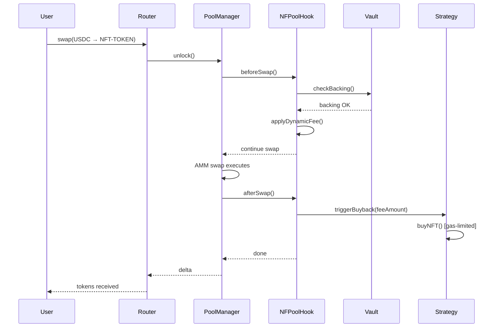

# NFPool Technical Implementation

This document contains detailed code examples and implementation patterns for NFPool components.

---

## Hook Implementation

### NFPool Hook Core

```solidity
contract NFPoolHook is BaseHook {
    enum PoolMode { COLLATERALIZED, SPECULATIVE, HYBRID }

    struct PoolConfig {
        PoolMode mode;
        uint256 backingRatio;      // 1.25e18 = 125% for Mode A/Hybrid
        uint256 feeStructure;       // Dynamic or fixed
        address strategyModule;     // Optional buyback strategy
        address nftVault;          // Custody for Mode A/Hybrid
    }

    function beforeSwap(...) external override {
        if (mode == COLLATERALIZED || mode == HYBRID) {
            // Enforce backing ratio
            require(vault.totalValue() >= totalSupply * backingRatio);
            // Check mint caps
            require(totalSupply < maxSupply);
        }

        // Apply dynamic fees
        uint24 fee = calculateDynamicFee(pool.health);

        return (IHooks.beforeSwap.selector, BeforeSwapDelta(0), fee);
    }

    function afterSwap(...) external override {
        // Capture fees
        uint256 fee = captureSwapFee(delta);

        if (mode == SPECULATIVE || mode == HYBRID) {
            // Trigger strategy (gas-limited, won't DoS)
            strategy.buyNFT{gas: 50_000}(fee);
        }

        if (mode == COLLATERALIZED || mode == HYBRID) {
            // Update vault accounting
            vault.updateInventory();
        }

        return (IHooks.afterSwap.selector, hookDelta);
    }
}
```

---

## NFT Vault Implementation

```solidity
contract NFTVault {
    mapping(uint256 => address) public nftOwner;  // Who deposited each NFT
    mapping(address => uint256[]) public userNFTs; // User's NFTs in vault
    uint256[] public inventory;                    // All held NFT IDs

    // Oracle integration for floor price
    IPriceOracle public oracle;

    function deposit(uint256 tokenId) external {
        nft.transferFrom(msg.sender, address(this), tokenId);
        inventory.push(tokenId);
        userNFTs[msg.sender].push(tokenId);

        // Mint backed tokens
        uint256 nftValue = oracle.getFloorPrice();
        token.mint(msg.sender, nftValue);

        emit NFTDeposited(msg.sender, tokenId, nftValue);
    }

    function redeem(uint256 tokenAmount) external {
        require(tokenAmount <= balanceOf(msg.sender));

        // Burn tokens
        token.burn(msg.sender, tokenAmount);

        // Return NFT proportionally
        uint256 tokenId = selectNFTForRedemption();
        nft.transferFrom(address(this), msg.sender, tokenId);

        emit NFTRedeemed(msg.sender, tokenId, tokenAmount);
    }

    function totalValue() external view returns (uint256) {
        return inventory.length * oracle.getFloorPrice();
    }
}
```

---

## Strategy Module Implementation

```solidity
contract StrategyModule {
    uint256 public constant MAX_GAS_PER_SWAP = 50_000;
    uint256 public feeThreshold = 0.1 ether;

    address[] public marketplaces; // OpenSea, Blur, etc.

    function buyNFT(uint256 feeAmount) external {
        require(feeAmount >= feeThreshold, "Below threshold");

        // Try to buy NFT from marketplace (gas-limited)
        (bool success,) = marketplace.call{gas: MAX_GAS_PER_SWAP}(
            abi.encodeWithSignature("buyFloorNFT()")
        );

        if (success) {
            // Relist at 1.2x for profit
            marketplace.list(nftId, floorPrice * 120 / 100);
        }

        // If fails, accumulate fees (no DoS)
    }

    function onNFTSold(uint256 salePrice) external {
        // Use proceeds to buy and burn tokens
        token.buyAndBurn{value: salePrice}();

        emit TokensBurned(salePrice, tokenAmount);
    }
}
```

---

## Dynamic Fee Calculation

```solidity
function calculateDynamicFee(uint256 poolHealth) internal view returns (uint24) {
    if (poolHealth < TARGET_HEALTH) {
        return baseFee + premiumFee; // Incentivize deposits
    } else {
        return baseFee - discountFee; // Encourage trading
    }
}
```

---

## Backing Verification

```solidity
function beforeSwap(...) external override {
    if (mode == COLLATERALIZED || mode == HYBRID) {
        uint256 vaultValue = vault.totalValue();
        uint256 requiredBacking = totalSupply * backingRatio / 1e18;

        if (vaultValue < requiredBacking) {
            revert InsufficientBacking(vaultValue, requiredBacking);
        }
    }
}
```

---

## Bounded Strategy Execution

```solidity
function afterSwap(...) external override {
    uint256 gasLimit = 50_000; // Max 50k gas
    (bool success,) = strategy.call{gas: gasLimit}(
        abi.encodeWithSignature("buyNFT(uint256)", fee)
    );
    // If fails, swap still succeeds (fees accumulate)
}
```

---

## Mode Transitions

```solidity
function transitionToHybrid() external onlyGovernance {
    require(mode == COLLATERALIZED, "Must start collateralized");
    require(backingRatio >= 1.5e18, "Need 150%+ backing");

    mode = PoolMode.HYBRID;
    // Enable speculative features while maintaining backing

    emit ModeTransitioned(COLLATERALIZED, HYBRID, block.timestamp);
}
```

---

## Mermaid Sequence Diagram


